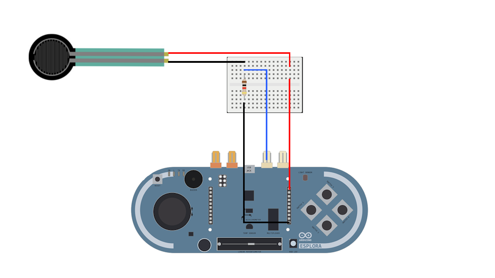

# [TI] - The Little One Controller
**Nota**: [Repositório para o projeto/código de Design De Jogos](https://github.com/ze-antunes/The_Little_One_Game)

<div align="center">
  <a href="https://youtube.com/shorts/4bLhB_w3Ywo?feature=share" target="_blank">
    
  </a>
</div>

## Introdução

Um projeto da cadeira de Tecnologias de Interface* desenvolvido a partir do tema "Interfaces technologies for children and learning" e com a junção do projeto da cadeira de Design de Jogos*. O desenvolvimento do projeto envolveu a criação de um controlador utilizando a placa [Arduino Esplora](https://docs.arduino.cc/retired/boards/arduino-esplora), projetado especialmente para um videojogo infantil. O controlador foi concebido levando em consideração o público-alvo composto por crianças com idades entre os 10 e os 16 anos. Através do controlador, os utilizadores terão a capacidade de interagir de forma intuitiva e divertida com o jogo, proporcionando uma experiência envolvente.

\* - Cadeiras do Mestrado em Design e Multimédia ([MDM](https://www.dei.uc.pt/mdm/)), da Faculdade de Ciências e Tecnologia da Universidade de Coimbra ([FCTUC](https://www.uc.pt/fctuc/)).

## Requisitos

<div align="center">
    
</div>

  * [Arduino Esplora](https://docs.arduino.cc/retired/boards/arduino-esplora)
  * [Breadboard Mini](https://www.amazon.com/mini-breadboard/s?k=mini+breadboard)
  * [Force Sensing Resistor (FSR sensor)](https://www.interlinkelectronics.com/force-sensing-resistor)
  * [10k Ohm resistor](https://www.amazon.com/10k-ohm-resistor/s?k=10k+ohm+resistor)
  * [Jumper wires](https://www.amazon.com/s?k=jumper+wires&sprefix=jumper%2Caps%2C183&ref=nb_sb_ss_ts-doa-p_1_6)
  * [USB-a to Micro USB cable](https://www.amazon.com/s?k=usb-a+to+micro+usb+cable&crid=1E7BGJ2U86M4I&sprefix=usb-a+to+micro+usb+cable%2Caps%2C364&ref=nb_sb_noss_1)
  * [Caixa/controlo](media/Blender_Prototype.png)
  * [4 parafusos allen 1mm half thread](https://l1nk.dev/IaiaX)
  * [Chave allen 1mm](https://www.amazon.com/1mm-allen-key/s?k=1mm+allen+key)

  **Nota**: [Modelo 3D (.stl)](3d_model/SolidWorks_Prototype_1.2.STL) para a caixa do controlo e [visualização online do modelo](https://cad.onshape.com/documents/36c6d5a5140d60a3c5676978/w/fa827a56d7e2ac818d680493/e/13c9c3b3afb0392e5b8b25fd?renderMode=0&uiState=647612a4b04a9a3714ebb083) na diretoria 3d-model
  
## Unity


Para iniciar o projeto no Unity são necessários os seguintes passos:

- Iniciar o projeto 2D vazio
- Importar o unity package **_Game_Prototype_**
- Importar o unity package **_A_Star_**
- Entrar no Package Manager e **instalar**:
  - Cinemachine
  - TextMeshPro
  - Input System
- Configurar a _Api Compatibility Level_:
  - File > Build Settings > Player Settings > Player > Other Settings > Configuration > Api Compatibility Level
  - **Api Compatibility Level: .NET Framework**

Quando todos os passos acima estiverem prontos, podemos passar para a comunicação entre o Unity e o Arduino.


## Comunicação Unity / Arduino

Dentro da diretoria _Scripts_, no ficheiro _ArduinoGameController_, teremos de mudar a porta onde o arduino se encontra ligado. É necessário alterar a porta e o baud para configurar a comunicação entre os dois programas.

```cs
 SerialPort sp = new SerialPort("PORTA_DO_ARDUINO", 9600); // set port of your arduino connected to computer (porta, baud)

```

---
Este projeto foi feito no âmbito da cadeira de Tecnologias de Interface da Faculdade de Ciências e Tecnologia da Universidade de Coimbra.
